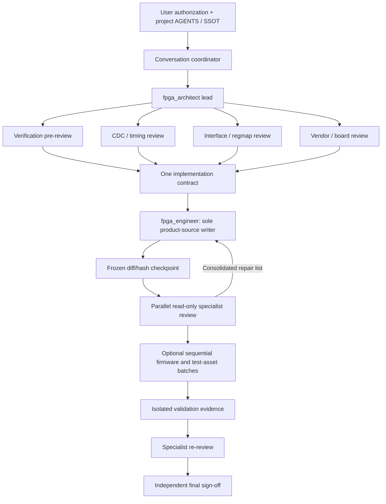

# Codex FPGA Engineering Workflow

<div align="center">


### Build FPGA changes with AI—without giving up engineering discipline.

[](https://github.com/prasetyarobert205-jpg/codex-fpga-engineering-workflow/actions/workflows/validate.yml)
[](LICENSE)
[](CHANGELOG.md)
[](docs/en/installation.md)
[](docs/en/architecture.md)

**Architecture · RTL · Verification · CDC/RDC · Timing · Interfaces · Vendor platforms · Board evidence · Independent sign-off**

[Quick start](#60-second-quick-start) · [Architecture](docs/en/architecture.md) · [Roles](docs/en/roles.md) · [Usage](docs/en/usage.md) · [Safety and evidence](docs/en/safety-and-evidence.md)

</div>

Codex FPGA Engineering Workflow is an open-source, installable multi-agent workflow for FPGA and SoC FPGA work. It turns AI assistance into a controlled engineering lifecycle: requirements and project facts first, parallel specialist analysis, one product-source writer, isolated validation, and independent review.

It is intentionally not a promise that a prompt can prove CDC correctness, timing closure, electrical safety, or board readiness. It provides the roles, gates, prompts, and evidence vocabulary needed to make those claims responsibly when the corresponding reports and measurements exist.

## Why this exists

FPGA failures rarely live in one file. A small RTL change can affect latency, backpressure, reset release, CDC structure, constraints, register semantics, tool-specific primitives, and board behavior. General-purpose coding agents can generate plausible HDL while missing those system effects.

This workflow makes the engineering boundaries explicit:

- **Project evidence stays authoritative.** Device, pin, voltage, clock, reset, register, tool, and acceptance facts come from the project SSOT—not an agent's memory.
- **One writer owns product sources.** Specialists may analyze in parallel, but they do not race to edit the same checkout.
- **Reviews use stable snapshots.** Long implementations pause at coherent checkpoints, freeze a diff/hash, collect critical findings, and return one repair list to the same writer.
- **Review independence is preserved.** The final reviewer does not coach the implementation or repair its own findings.
- **Evidence levels remain separate.** Source review, simulation, formal proof, CDC/RDC, synthesis, implementation STA, instrument measurements, and board results are not interchangeable.
- **Vendor details stay at the platform boundary.** Portable product logic is separated from primitives, IP, pins, clocks, transceivers, constraints, and target wrappers.

## 60-second quick start

Prerequisite: [PowerShell 7](https://learn.microsoft.com/powershell/) and a Codex environment that supports custom agents and skills.

```powershell
git clone https://github.com/prasetyarobert205-jpg/codex-fpga-engineering-workflow.git
cd codex-fpga-engineering-workflow
pwsh -NoProfile -File .\scripts\validate-package.ps1
pwsh -NoProfile -File .\scripts\install.ps1 -Scope User
pwsh -NoProfile -File .\scripts\verify-install.ps1 -Scope User
```

Start a new Codex session, open an FPGA repository, and try:

```text
Use $run-fpga-workflow in ANALYZE mode. Inspect this CDC failure read-only,
inventory the real clock relationships and constraints, separate confirmed facts
from unknowns, and do not claim PASS without current reports.
```

For repository-local installation, use `-Scope Project -ProjectPath C:\path\to\repo`. The FPGA `AGENTS.md` template is opt-in and is never installed by default. See the [safe installation guide](docs/en/installation.md) before using `-Force`.

## Architecture at a glance



The conversation coordinator is the control plane: it protects authorization, selects a workflow mode, reads the evidence baseline, schedules roles, resolves evidence conflicts, controls sequential write batches, isolates validation jobs, and reports what is proven versus still unknown. The project SSOT remains the source of truth throughout.

### Stable-checkpoint supervision

“Near-real-time supervision” means reviewing a coherent, frozen snapshot—not watching every generated character:

1. The writer completes a small, understandable slice and stops.
2. The coordinator records the diff/hash for that exact state.
3. Relevant read-only specialists review the same snapshot in parallel.
4. Findings are severity-ranked and consolidated into one repair list.
5. The same writer repairs the slice; affected specialists re-check it.

Recommended checkpoints include the interface skeleton, FSM and error recovery, datapath/FIFO/RAM/DSP, CDC/reset, register/IRQ/DMA, vendor wrapper/constraints, and final integration. `BLOCKER` or `HIGH` findings stop the next slice. The final reviewer stays outside this coaching loop to preserve independent sign-off.

## The 12 roles

| Role | Primary responsibility | Permission model |
|---|---|---|
| `fpga_architect` | Requirements, microarchitecture, data flow, performance budgets, ownership, and acceptance criteria | Strictly read-only |
| `fpga_engineer` | Minimal synthesizable changes to RTL, constraints, platform wrappers, regmap implementation, and FPGA build scripts | Sole default product-source writer |
| `verification_engineer` | Test strategy, testbench, assertions, reference models, coverage, and regression evidence | Product read-only; test assets only in a separate sequential batch |
| `fpga_cdc_timing_reviewer` | Clocks, resets, CDC/RDC, constraints, exceptions, I/O timing, and STA evidence | Strictly read-only |
| `fpga_interface_architect` | CSR, commands, mailbox, IRQ, DMA, endianness, atomicity, and firmware compatibility | Strictly read-only |
| `fpga_vendor_platform_reviewer` | Vendor IP, primitives, wrappers, constraints, and target consistency | Strictly read-only |
| `fpga_board_validation_engineer` | Electrical prerequisites, safe bring-up, observability, and instrument evidence | Strictly read-only; never operates hardware |
| `fpga_reviewer` | Independent final review of requirements, integrated diff, reports, and release claims | Strictly read-only; never repairs findings |
| `system_architect` | Cross-domain FPGA/hardware/firmware boundaries and ownership | Conditional, strictly read-only |
| `embedded_engineer` | Confirmed FPGA-facing firmware, CSR, IRQ, DMA, and error-recovery implementation | Conditional firmware-only sequential writer |
| `hardware_datasheet` | Exact part, document revision, page, electrical, clock, reset, and pin evidence | Conditional, strictly read-only |
| `independent_reviewer` | Cross-domain or safety-critical release sign-off | Conditional, strictly read-only |

Nine role configurations explicitly set `sandbox_mode = "read-only"`. No implementer may issue its own final `PASS`. See [roles and write ownership](docs/en/roles.md) for triggers, deliverables, prohibited actions, and the write-order matrix.

## Choose the right mode

| Mode | Use it for | Writes | Required discipline |
|---|---|---|---|
| `ANALYZE` | Diagnosis, architecture, source/report review, release audit | None | Read-only evidence baseline and relevant specialist review |
| `QUICK` | Explicitly authorized, small, interface-preserving, single-clock, low-risk fixes | One minimal product batch | Existing tests, verification review, independent final review |
| `FULL` | New RTL, CDC/RDC, regmap/IRQ/DMA, constraints, vendor IP, external timing, possible data loss, energy control, or significant refactoring | Controlled sequential batches | Architecture contract, relevant pre-reviews, isolated validation, specialist re-review, independent sign-off |

Risk never expands write authorization. A crossing, published interface, external timing change, vendor IP/constraint change, or safety-sensitive output must not be downgraded to `QUICK` for convenience.

## Use cases

- Diagnose a CDC/RDC warning without hiding it behind a broad waiver.
- Plan and implement an AXI-Stream or FIFO datapath with explicit throughput, latency, alignment, and backpressure.
- Review a register map, IRQ clear sequence, DMA ownership protocol, or firmware compatibility change.
- Compare portable RTL with Xilinx/AMD, Intel, Anlogic, Pango, or other target wrappers without duplicating business logic.
- Audit combinational depth, cascaded priority/MUX logic, fanout, and critical paths using actual synthesis/implementation evidence.
- Build a requirement-to-design-to-test trace for a risky refactor.
- Prepare a safe board-validation procedure while keeping physical actions under qualified human control.
- Review a release claim and identify exactly which evidence is present, missing, stale, or target-specific.

## Safe installation behavior

The installer deploys the 12 agent TOML files and the `run-fpga-workflow` skill. It does **not** overwrite an existing file with different content unless `-Force` is explicitly supplied. Forced replacement creates a timestamped backup first. `-WhatIf` previews the plan. The optional FPGA rules template requires `-InstallAgentsTemplate`.

Uninstall uses the recorded manifest and SHA-256 values. It removes only exact installed files that remain unchanged, preserves user-modified files, and never recursively deletes a broad directory tree.

```powershell
# Preview project-local installation
pwsh -NoProfile -File .\scripts\install.ps1 -Scope Project `
  -ProjectPath C:\path\to\repo -WhatIf

# Opt in to the FPGA AGENTS.md template
pwsh -NoProfile -File .\scripts\install.ps1 -Scope Project `
  -ProjectPath C:\path\to\repo -InstallAgentsTemplate
```

Full instructions: [install, verify, upgrade, and uninstall](docs/en/installation.md).

## Repository layout

```text
.codex-plugin/plugin.json           Plugin metadata
.codex/agents/*.toml                Twelve role definitions and prompts
skills/run-fpga-workflow/           Orchestration skill and reference policies
templates/AGENTS.fpga.md             Optional project/user engineering rules
examples/*.prompt.md                Copyable ANALYZE, QUICK, and FULL prompts
docs/en/                            Architecture, roles, installation, usage, safety
scripts/                            Install, verify, uninstall, package validation
.github/                            Validation workflow and contribution templates
```

## Evidence and safety boundary

The workflow uses an evidence ladder rather than a single “tested” label:

`source review → lint/elaboration → RTL simulation → formal → CDC/RDC → synthesis → implementation/STA → instrument measurement → board result`

Each level proves something different, and no earlier level automatically replaces a later one. Passing claims should include the exact command, tool and version, exit status, important warnings, and report path. Checks that were not executed are `NOT RUN`; missing or unread evidence is `UNVERIFIED`.

Physical wiring, power-up, download, motion, heat, lasers, relays, high voltage, and other energy-producing operations remain qualified human actions with project-specific prerequisites, expected readings, stop conditions, and recovery steps. This repository is not functional-safety certification and contains no default board electrical facts. Read [Safety and evidence](docs/en/safety-and-evidence.md).

## Documentation

| Guide | What it covers |
|---|---|
| [Architecture](docs/en/architecture.md) | Control plane, lifecycle, safe parallelism, checkpoints, SSOT, and sign-off independence |
| [Roles](docs/en/roles.md) | All 12 roles, triggers, permissions, deliverables, prohibited actions, and write order |
| [Installation](docs/en/installation.md) | Prerequisites, preview, user/project scope, backups, upgrade, verification, and uninstall |
| [Usage](docs/en/usage.md) | Mode selection, copyable prompts, checkpoints, and expected reports |
| [Safety and evidence](docs/en/safety-and-evidence.md) | Evidence ladder, claim boundaries, and high-energy user-action gates |
| [Compatibility](COMPATIBILITY.md) | Exercised package environment and schema caveats |
| [Research record](docs/research.md) | Dated ecosystem comparison and adoption rationale |
| [Changelog](CHANGELOG.md) | Release history |

## Current limitations

Version `0.2.0` provides package structure validation and English documentation. Fresh-session Codex discovery after installation remains **UNVERIFIED** until exercised in a clean environment. The repository does not include a vendor EDA toolchain, an FPGA design, board constraints, or board-specific electrical facts. It does not claim synthesis success, timing closure, CDC/RDC cleanliness, bitstream readiness, or hardware validation for a user's project.

Custom-agent, skill, and plugin schemas can evolve. Pin a release and re-run the included validation and installation verification after Codex updates. See [COMPATIBILITY.md](COMPATIBILITY.md).

## Contribute, report, and build with us

If disciplined AI-assisted FPGA engineering matters to you:

- **Star the repository** so other FPGA engineers can find it.
- **Try it on a real, non-confidential task** and share what the workflow caught—or what it missed.
- **Open an issue** for a role gap, unclear gate, tool compatibility problem, or evidence boundary that needs refinement.
- **Contribute** focused improvements that preserve single-writer ownership, reviewer independence, and honest evidence labels.

Read [CONTRIBUTING.md](CONTRIBUTING.md) before opening a pull request. Report vulnerabilities privately as described in [SECURITY.md](SECURITY.md). Licensed under the [MIT License](LICENSE).

---

<div align="center">

**Make the next FPGA change reviewable, reproducible, and honest about what the evidence proves.**

[Get started](docs/en/installation.md) · [Try a prompt](docs/en/usage.md) · [Open an issue](https://github.com/prasetyarobert205-jpg/codex-fpga-engineering-workflow/issues) · [Star on GitHub](https://github.com/prasetyarobert205-jpg/codex-fpga-engineering-workflow)

</div>
