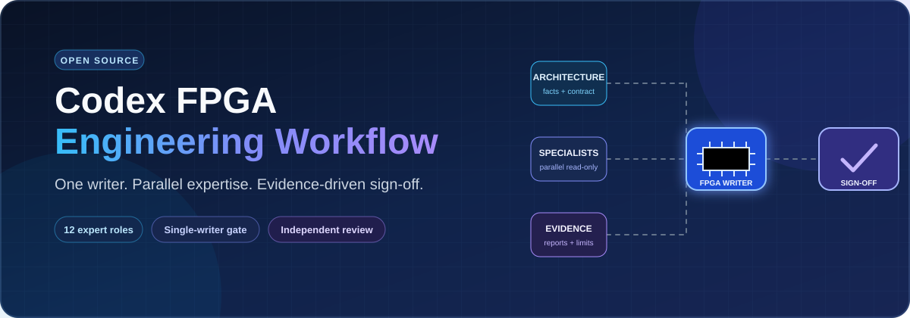
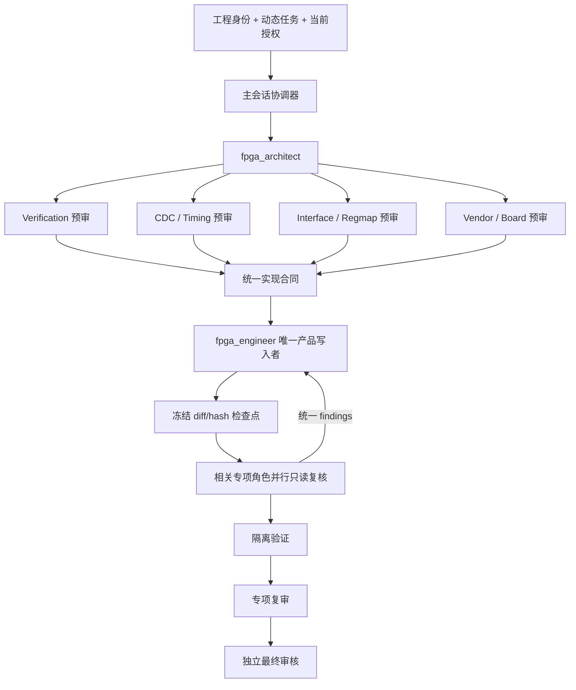

# Codex FPGA 工程工作流

[English](README.md) | [简体中文](README.zh-CN.md)

<div align="center">



### 把 AI 辅助 RTL 开发变成可审查、可复现、证据边界清晰的 FPGA 工程流程

[](https://github.com/prasetyarobert205-jpg/codex-fpga-engineering-workflow/actions/workflows/validate.yml)
[](LICENSE)
[](CHANGELOG.md)
[](docs/zh-CN/architecture.md)

**13 个专用角色 · 动态工程/任务契约 · 官方 IP 流程 · 证据触发的 P&R · 单一产品写入者 · 独立终审**

[快速开始](#60-秒快速开始) · [架构](docs/zh-CN/architecture.md) · [角色](docs/zh-CN/roles.md) · [使用](docs/zh-CN/usage.md) · [证据与安全](docs/zh-CN/safety-and-evidence.md)

</div>

Codex FPGA Engineering Workflow 是一个面向 FPGA 和 SoC FPGA 的开源、
可安装、多角色工程工作流。它帮助 Codex 处理 RTL、仿真、CDC/RDC、
时序、官方 IP、厂商工程、板级证据和最终审核，同时保持：

- 产品源码只有一个默认写入者；
- 专项角色只读并独立；
- 长任务在稳定 diff/hash 检查点复核；
- compile、仿真、STA、CDC 和上板证据互不冒充；
- 大工程按时钟域和 transaction impact cone 分片；
- 没有运行的检查明确标记为 `NOT RUN` 或 `UNVERIFIED`。

它不是“一条提示词自动证明时序闭合或上板正确”的承诺。它的目标是：

> 在保留 AI 开发速度的同时，不丢掉决定 FPGA 是否能在真实目标器件、
> 时钟和板卡上工作的工程问题。

## 为什么需要它

一个 RTL 改动可能同时影响 latency、throughput、backpressure、FIFO、
时钟/复位、CDC/RDC、约束、官方 IP、布局布线、寄存器、固件和板级行为。

本工作流把这些边界显式化：

- **工程事实优先。** 器件、引脚、电压、时钟、复位、寄存器和工具版本来自项目 SSOT。
- **工程身份稳定，任务动态变化。** 身份卡减少重复查找；每轮新问题通过 task delta 更新。
- **产品写入者唯一。** 专项角色可并行分析，但不争抢同一 checkout 的写权限。
- **官方 IP 有明确责任。** 复用 managed IP、增量生成、staging/import、官方 Tcl/CLI，GUI只做一次性兜底。
- **P&R 由证据触发。** 冻结基线、分类真实路径、一次修改一个变量，再比较保留或回滚。
- **终审保持独立。** final reviewer 集成专项证据，不参与原实现，也不重复全部专项。
- **流程按声明等级启用。** compile/smoke 不自动触发完整 CDC、STA、formal、功耗或 release。
- **功耗默认关闭。** 只有明确要求或真实功耗/热/安全/release 预算时启用。

## 60 秒快速开始

安装和脚手架需要 PowerShell 7。生成后的 `run.bat` 不依赖 Codex 私有
PowerShell，而是调用已确认的厂商原生 Tcl/DO/CLI。

```powershell
git clone https://github.com/prasetyarobert205-jpg/codex-fpga-engineering-workflow.git
cd codex-fpga-engineering-workflow
pwsh -NoProfile -File .\scripts\validate-package.ps1
pwsh -NoProfile -File .\scripts\install.ps1 -Scope User
pwsh -NoProfile -File .\scripts\verify-install.ps1 -Scope User
```

打开 FPGA 工程后可以这样使用：

```text
使用 $run-fpga-workflow，以 ANALYZE 模式只读检查当前 CDC 报告。
确认真实时钟关系、跨域结构和约束；区分 CONFIRMED、INFERRED、UNKNOWN，
没有当前 CDC/RDC/STA 证据时不要声称 PASS。
```

项目级安装、备份、升级和卸载参见
[中文安装指南](docs/zh-CN/installation.md)。

## 工程身份卡与动态任务

可选的极简身份卡只保存稳定信息：

```text
工程根：
正式 .xpr/.pds/.al：
厂商和工具版本：
完整 part：
产品 top / 仿真 top：
build / sim / lint 入口：
长期保护项：
```

身份卡只用于定位，不自动授权写 RTL、clean、重生成 IP、implementation、
release、上传、Flash 或物理板卡操作。

后续每轮问题生成：

```text
INITIAL | SUPPLEMENTS | SUPERSEDES | EXPANDS | NARROWS
```

同一工程普通 follow-up 只刷新受影响 diff、影响锥、验证资产和证据。

## 总体架构



## 实现者五种条件模式

| 模式 | 责任 |
|---|---|
| `RTL_IMPLEMENTATION` | RTL、wrapper 和必要约束 |
| `IP_INTEGRATION` | 官方 XCI/IDF/IPC、生成 recipe 和工程集成 |
| `BUILD_FLOW` | BAT、Tcl、DO、filelist、路径和库 |
| `PHYSICAL_IMPLEMENTATION` | 证据触发的 implementation QoR 和时序闭环 |
| `RELEASE_PACKAGING` | 明确授权的 bit/bin/mcs、manifest 和 hash |

## 官方 IP 快速决策

```text
当前工程 managed IP 且契约匹配 → 直接复用
只缺 output products → 本机同版本官方工具增量生成
复制或旧 IP → 检查 source view → staging/import 或官方重建
新 IP 且官方 Tcl/CLI 已确认 → batch 生成
当前版本无法可靠脚本化 → 官方 GUI 一次 → 导出 recipe
```

互联网用于查同版本官方手册、参数、命令、example 和限制；不会把网上
找到的 XCI/IDF/IPC直接当产品配置。

## 证据 profile 与 claim stage

| Profile | 用途 |
|---|---|
| `DIAGNOSTIC_SMOKE` | 路径、工具、compile、elaboration、有限运行 |
| `FUNCTIONAL_ACCEPTANCE` | 使用仿真接受 DUT 功能 |
| `SPECIALIST_ACCEPTANCE` | formal、CDC/STA、电气或 release 专项接受 |

claim stage：

```text
PREFLIGHT
COMPILE
SIM_SMOKE
FUNCTIONAL_SIM
SYNTHESIS
IMPLEMENTATION_QOR
TIMING_CLOSURE
FORMAL
RELEASE
BOARD_PREP
```

## 标准工程脚手架

```powershell
pwsh -NoProfile -File .\scripts\new-fpga-project.ps1 -Destination C:\work\my-fpga -ProjectName my-fpga -TopModule top -Vendor XILINX
```

标准用户可见脚本：

```text
project/script/
├─ run.bat
├─ setting.bat
├─ src_list.txt
└─ 一个已确认的厂商 Tcl/CLI flow

simulation/script/
├─ run.bat
├─ setting.txt
├─ src_list.txt
└─ vsim.do
```

厂商工程和日志进入 `project/par`；ModelSim/Questa 的导出、库、日志和波形
进入 `simulation/work`；Codex 诊断副本进入 `codex_out`。

## 13 个角色

| 角色 | 主要责任 |
|---|---|
| `fpga_architect` | 工程身份、动态 task contract、架构、预算和角色路由 |
| `fpga_engineer` | 唯一产品写入者，五种条件模式 |
| `verification_engineer` | TB、assertion、独立模型、scoreboard 和回归 |
| `fpga_temporal_evidence_reviewer` | Shadow 逐拍和仿真证据审核 |
| `fpga_cdc_timing_reviewer` | CDC_STRUCTURE、STA_COVERAGE、PHYSICAL_QOR、TIMING_CLOSURE |
| `fpga_interface_architect` | CSR、命令、IRQ、DMA 和固件契约 |
| `fpga_vendor_platform_reviewer` | IP、原语、wrapper、约束和 target 证据 |
| `fpga_board_validation_engineer` | 安全上板方案和仪器证据解释 |
| `fpga_reviewer` | 独立集成终审 |
| `system_architect` | 条件性的跨 FPGA/硬件/固件架构 |
| `embedded_engineer` | 条件性的 FPGA 相关固件写入 |
| `hardware_datasheet` | 精确手册、页码、电气和器件证据 |
| `independent_reviewer` | 跨领域或安全关键 release 终审 |

## 中文文档

| 文档 | 内容 |
|---|---|
| [中文导航](docs/zh-CN/README.md) | 中文文档总入口 |
| [架构](docs/zh-CN/architecture.md) | 身份卡、task delta、生命周期和并行边界 |
| [角色](docs/zh-CN/roles.md) | 13 个角色、五种实现模式和写入顺序 |
| [安装](docs/zh-CN/installation.md) | 验证、安装、项目级部署、升级和卸载 |
| [使用](docs/zh-CN/usage.md) | 模式、claim stage、提示词和工程脚手架 |
| [证据与安全](docs/zh-CN/safety-and-evidence.md) | 证据阶梯、声明边界和板级安全 |

英文文档入口：[docs/en](docs/en/architecture.md)。

## 当前边界

0.4.0 的 package validation 证明角色、schema、模板、PowerShell 和公开内容
符合包约束，但不证明每个真实 EDA target、DUT 功能、CDC/RDC、时序闭合、
bitstream 或板卡已经通过。Pango、Anlogic 和不同工具版本仍必须读取当前
项目和官方工具证据。

## 参与和支持

- 如果项目有帮助，请给仓库一个 Star；
- 在非机密真实任务中试用并反馈发现的问题或漏检；
- 提交 Issue 说明角色缺口、工具兼容或证据边界；
- 提交聚焦、可验证、不会削弱单写入和独立审核的改进。

[贡献指南](CONTRIBUTING.md) · [安全策略](SECURITY.md) · [MIT License](LICENSE)

---

<div align="center">

**让下一次 FPGA 修改可审查、可复现，并诚实说明证据到底证明了什么。**

[开始安装](docs/zh-CN/installation.md) · [查看使用方法](docs/zh-CN/usage.md) · [提交 Issue](https://github.com/prasetyarobert205-jpg/codex-fpga-engineering-workflow/issues) · [GitHub Star](https://github.com/prasetyarobert205-jpg/codex-fpga-engineering-workflow)

</div>
