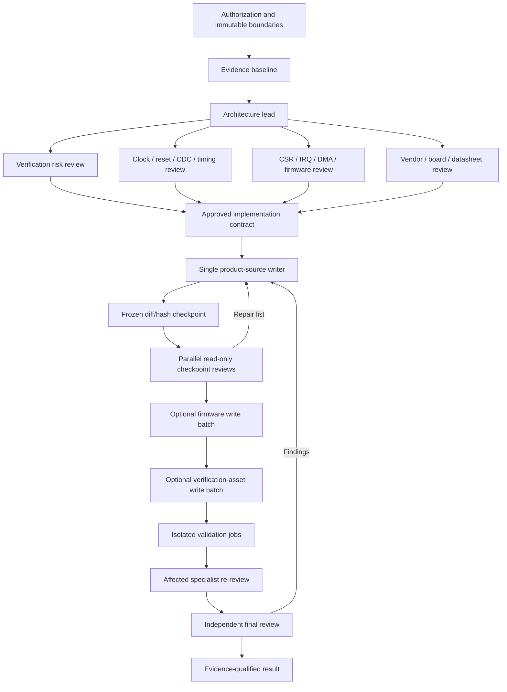

# Architecture

[README](../../README.md) · [Roles](roles.md) · [Installation](installation.md) · [Usage](usage.md) · [Safety and evidence](safety-and-evidence.md)

## Design goal

The workflow adds engineering control to AI-assisted FPGA development. Its defining model is **parallel read-only expertise, one product-source writer, isolated validation, and independent sign-off**. It is designed to preserve a reviewable diff and an honest chain of evidence—not to maximize agent count, paperwork, or code-generation speed.

Governance is proportional to the claim. A diagnostic compile/elaborate/run can remain lightweight. Full functional, formal, CDC/RDC, implementation/STA, electrical, or release evidence is required only when the result is used for that acceptance decision.

## Control plane

The main Codex conversation is the control plane. It does not replace the specialist roles; it coordinates them. Its responsibilities are to:

1. confirm the user's authorization and unchanged boundaries;
2. select `ANALYZE`, `QUICK`, or `FULL` without using risk to expand write scope;
3. load applicable `AGENTS.md` files, project SSOT, requirements, RTL, constraints, tests, scripts, tool versions, reports, and the current diff;
4. label important facts as `CONFIRMED`, `INFERRED`, or `UNKNOWN`;
5. dispatch only the roles relevant to the task;
6. expose conflicts between role conclusions and resolve them from evidence, not by vote;
7. serialize write batches and freeze snapshots for review;
8. select a diagnostic/smoke or claim-specific acceptance profile, isolate validation jobs, and collect the evidence that profile needs;
9. keep the final reviewer independent; and
10. report the achieved evidence level, missing checks, remaining risks, and user-only board actions.

`fpga_architect` is the technical lead. It converts requirements and project facts into one implementation contract. The conversation coordinator remains responsible for authorization, role scheduling, and enforcement of the lifecycle.

## End-to-end lifecycle

For an `ANALYZE` task, the write and repair nodes are skipped. For a small `QUICK` task, the coordinator uses the minimum relevant role set while preserving one writer and honest review. `FULL` tasks use relevant pre-reviews and only the evidence gates needed by the requested acceptance claims.

## Safe parallelism

Parallel work is encouraged when it is genuinely independent:

- architecture, verification planning, CDC/timing, interface, vendor, datasheet, and board reviews on a stable input;
- re-review of one frozen integrated diff by multiple read-only specialists;
- EDA jobs with distinct output directories, project databases, work libraries, IP/cache directories, seeds, and report paths.

Parallel work is prohibited when it can corrupt state or ownership:

- multiple roles editing product RTL or constraints in one checkout;
- overlapping product, firmware, and test-asset write batches;
- simultaneous Vivado runs sharing the same run directory;
- Quartus jobs sharing the same project database;
- ModelSim/Questa jobs sharing one `work` library;
- IP generation or report jobs sharing mutable output directories.

If an EDA tool writes in place and cannot be isolated, the job runs serially. Parallel writers require explicit user authorization, disjoint files, separate worktrees or branches, and integration into one reviewable diff; they are not the default workflow.

## Frozen diff/hash supervision

Checkpoint supervision gives the writer critical feedback during a long implementation without turning the checkout into a race.

1. **Complete a coherent slice.** Examples: interface skeleton, FSM/error recovery, datapath, crossing structure, regmap, vendor wrapper, or constraints.
2. **Stop all writes.** The coordinator records the current diff and, where useful, file hashes or a commit identifier.
3. **Review one immutable snapshot.** Relevant specialists inspect exactly the same state in parallel.
4. **Consolidate findings.** Every actionable finding includes severity, file/line, trigger, impact, evidence, required repair, and re-check.
5. **Resume one writer.** The same owning implementer applies one consolidated repair list.
6. **Re-check affected areas.** Specialists confirm the repair against the new snapshot.

`BLOCKER` and `HIGH` findings stop the next implementation slice. `MEDIUM` and `LOW` findings remain visible and are either repaired or explicitly dispositioned. This model is near-real-time at engineering checkpoints; it is not character-by-character monitoring.

## Final reviewer independence

The `fpga_reviewer` reviews the final integrated diff and actual evidence. It must not:

- participate in the original implementation;
- prescribe each implementation step during checkpoint coaching;
- edit product or test sources;
- repair its own findings; or
- accept self-reported evidence without inspecting the relevant files and reports.

Repairs return to the appropriate sequential writer, followed by affected specialist re-review and a fresh final review. Cross-domain or safety-critical releases add `independent_reviewer` after the FPGA final review.

## Project SSOT and precedence

The workflow package defines stable process rules. It deliberately does not contain a user's device, package, board, pins, voltages, clock frequencies, reset polarity, addresses, register values, IP configuration, vendor command lines, or historical pass status.

For project facts, the current repository is authoritative. A practical precedence order is:

1. higher-priority platform and safety instructions;
2. applicable repository `AGENTS.md` files and explicit user authorization;
3. project requirements, interface contracts, register source of truth, constraints, target configuration, and approved reports;
4. this reusable workflow;
5. prior experience or memory as a hypothesis only.

If project evidence conflicts with a remembered pattern, the project evidence wins. Missing facts that can change an interface, clock relationship, electrical safety decision, license obligation, or acceptance conclusion are blocking unknowns—not opportunities to guess.

## Architecture invariants

- Product-source ownership is singular per checkout.
- Reviewers report findings and do not fix them.
- Verification cannot weaken a test to obtain a pass.
- A clean RTL simulation is not CDC proof, timing closure, electrical proof, or board validation.
- Constraints are part of the design specification, not a mechanism for hiding failures.
- Vendor-specific logic remains behind target/platform boundaries whenever practical.
- Physical high-energy actions remain under qualified human control.
- Missing or unread evidence remains `NOT RUN` or `UNVERIFIED`.
- Temporal review is bounded by a stable snapshot and impact cone; it returns `NEEDS_PARTITION` instead of silently truncating a large design.
- Verification authors do not independently accept evidence produced by models/checkers they changed.
- Diagnostic/smoke completion is never mislabeled as functional `SIMULATION_PASS`.
- Formal evidence is independently accepted by `fpga_reviewer` only when formal proof is used for an acceptance claim.
- All Codex-generated process files use project-root `codex_out`.
- Generated standard directories are canonical: `project/`, `project/par/`, `project/script/`, `simulation/`, `linter/`, `release/`, and `codex_out/`; numbered variants are not generated.
- Automatic repair stops after three rounds or two consecutive no-progress rounds.

## Stable artifacts and shadow evidence

Non-trivial work uses task, snapshot, impact, cycle, verification, run, simulation-evidence, and findings-ledger artifacts. These bind every report and finding to the same source state. The 13th role reviews temporal and simulation evidence in `STATIC_CYCLE`, `SIMULATION_EVIDENCE`, or `COMBINED` mode. It starts as `SHADOW`, handles one bounded clock-domain transaction cone, and supplies specialist findings to the final reviewer without replacing CDC/RDC, STA, or release sign-off.

Next: review the [complete role matrix](roles.md) or select a workflow mode in the [usage guide](usage.md).
